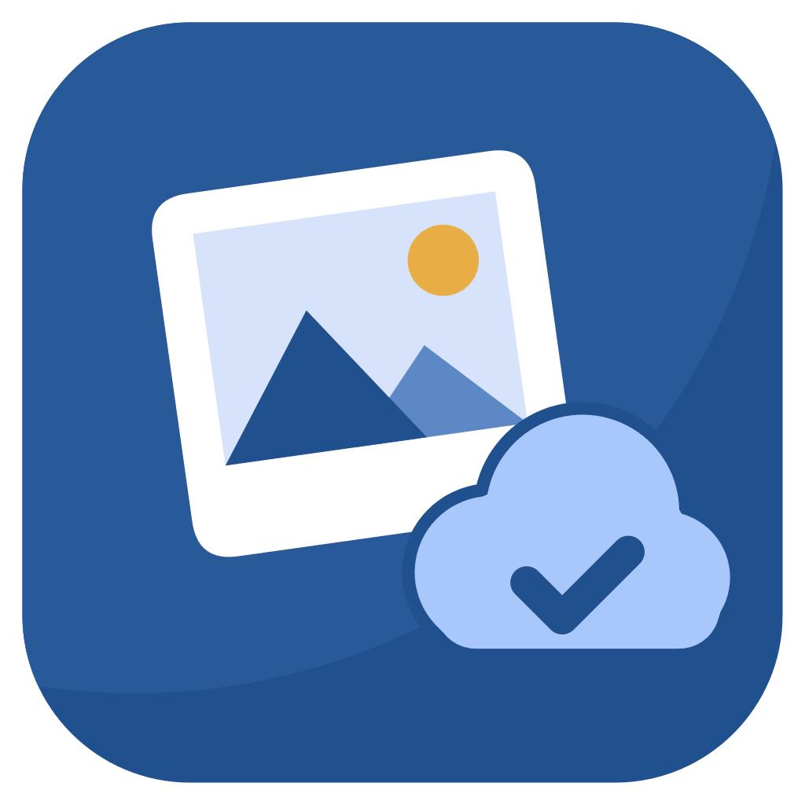
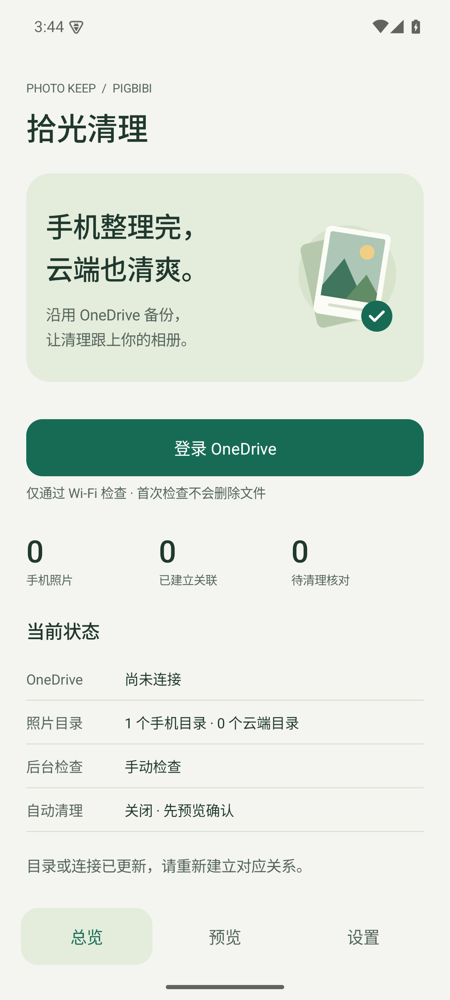
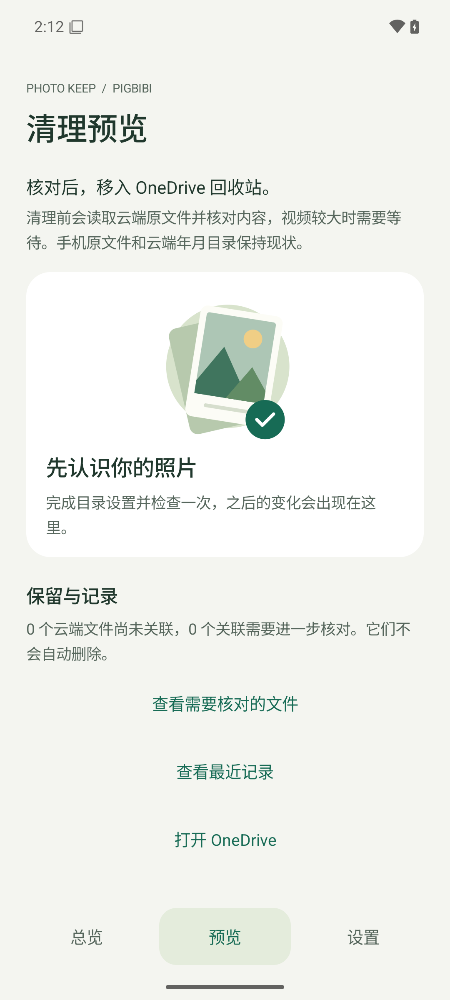
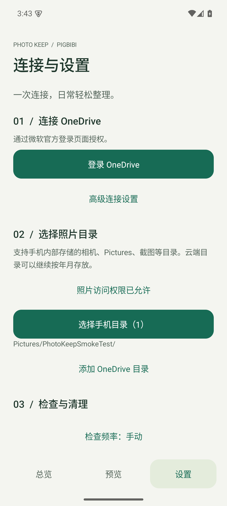

# 拾光清理 · PhotoKeep



**保留 OneDrive 的自动备份，让手机上的清理跟上云端。**

PhotoKeep 是一个独立的 Android 开源工具，由手机直接连接 Microsoft Graph。你继续使用 OneDrive 官方应用备份原图和视频，PhotoKeep 负责建立对应关系、检查删除，并将确认的云端文件移入回收站。无需自建服务器。

[下载 v0.2.0 APK](https://github.com/Pigbibi/OneDriveDeletionHelper/releases/tag/v0.2.0) · [安装与微软连接教程](docs/SETUP.zh-CN.md) · [隐私说明](docs/PRIVACY.md) · [MIT 协议](LICENSE)

> **这是预发布初版。** 发布 APK 已内置项目的公开微软应用编号，安装后点击“登录 OneDrive”并授权即可；普通用户无需注册应用。工作/学校账号可能需要组织管理员批准。真实 Android 设备、系统相册及 Google Photos 的删除表现，以及 OneDrive 账号的完整联调尚待验证，请先用测试照片。

<p>
  
  
  
</p>

截图来自 Android 15 模拟器中的实际应用，未使用真实照片或账号。

## 支持什么

- 内置微软 OAuth 登录；普通用户直接授权，自定义 Client ID 仅保留在高级设置。
- 原创矢量图标，适配 Android 圆形、圆角桌面图标及 Android 13+ 主题图标。
- 选择内部存储的多个照片目录，如 `DCIM/Camera/`、`Pictures/`、截图；包含所选目录的子目录。
- 选择多个 OneDrive 照片目录，递归读取并处理分页。手机和云端目录结构不必一致，可保留现有年月分类。
- 检查本地照片和视频的内容校验值；移动、改名、仍有相同本地副本时保留云端文件。
- 手动检查、清理预览、逐项确认、保留所选、最近记录。
- 每 6 小时、12 小时或每天进行后台检查，使用 Wi-Fi；系统可能推迟运行。
- 可选自动清理：默认关闭，仅处理**系统明确标记为回收站**、连续两次有效检查且满 24 小时的文件。
- 执行清理前流式读取云端原文件，核对 SHA-256 和完整字节数；重新确认文件版本、目录范围及手机媒体库状态。
- 只调用普通回收站删除，附带 `If-Match`；禁用删除请求的自动重试。结果未知时保留记录并暂停自动清理。

## 使用边界

| 情况 | 当前处理 |
|---|---|
| 手机已进入系统回收站，关联明确 | 满足条件后可自动清理 |
| 文件直接从手机消失 | 仅手动确认；无法区分删除、移动到隐藏目录、释放空间 |
| Google Photos 只删除云端照片 | 本应用无法获知；不读取 Google Photos 云端图库 |
| Google Photos 删除了本地文件 | 根据 Android 可见状态进入系统回收站候选或人工核对 |
| 现有 OneDrive 历史多余、重复文件 | 不批量去重或清理；未建立对应关系的文件保留 |
| 手机照片在建立对应关系之前就被删除 | 无法追溯，不自动删除云端文件 |
| 同名同大小、实际内容不同 | 内容核对失败，保留 |
| 云端年月目录 | 保留当前结构；本应用不创建或重新整理年月文件夹 |
| 相册中的人物、收藏、共享相册等逻辑分组 | 不复制这些分组 |
| SD 卡、应用私有目录、保险箱、未被系统索引的文件 | 初版不支持 |
| 动态照片、HEIC/RAW 等特殊格式 | 按原始字节核对；接口返回不同内容时保留，不能保证所有厂商格式匹配 |

首次扫描只建立**候选对应关系**：文件名和大小只能缩小范围，不能授权删除。云端完整内容核对发生在清理前，避免首次配置就下载整个相册。这个步骤会消耗下载流量，长视频可能耗时较久，但不会另存照片副本或重新上传。

## 安装与开始

1. 从 Releases 下载 `PhotoKeep-0.2.0.apk`，在 Android 11 或更新版本安装。允许该安装来源安装应用。
2. 点击 **登录 OneDrive**，在微软官方页面完成登录和授权；详见[连接教程](docs/SETUP.zh-CN.md)。
3. 在应用里选择全部照片权限、手机目录和 OneDrive 目录。
4. 连接 Wi-Fi，建立首次对应关系。先用几张测试照片检查“删除、移动、改名、保留副本”的行为。
5. 在清理预览中确认测试结果，再按需要启用定期检查和自动清理。

**更新时覆盖安装，不要先卸载。** 对应关系仅保存在手机，卸载或清除应用数据会丢失记录，不能继续追溯以前的删除。已发布 APK 使用独立签名；自己编译的 APK 通常不能覆盖安装官方发布包。

## 隐私与权限

没有开发者服务器、广告或开发者数据上报。应用的私有记录不参与云备份或设备迁移，避免将另一部手机的文件缺失误当成删除。微软登录由 MSAL 处理，不把密码、访问令牌或下载链接写入应用记录。

Microsoft Graph 的 `Files.ReadWrite` 权限本身包含读写能力，并非“只删除权限”；本项目业务代码只实现查询、内容核对和移入回收站。读取原始媒体信息用于核对完整原文件字节，不提取位置坐标作为功能。详见[隐私说明](docs/PRIVACY.md)。

## 开发与构建

使用 Java 17、Android SDK（`platforms;android-37.0`、`build-tools;36.0.0`）。Gradle Wrapper 9.6.1、Android Gradle Plugin 9.3.1；最低 Android API 30、目标 API 35。

```sh
./gradlew :app:testDebugUnitTest :app:lintDebug :app:assembleDebug
```

调试安装包位于 `app/build/outputs/apk/debug/app-debug.apk`。Android Studio 可以直接打开项目根目录。SDK 位置使用 `ANDROID_HOME` 或本机未跟踪的 `local.properties` 配置。

发布包构建与密钥管理见[发布说明](docs/RELEASING.md)。自行编译时，APK 签名与项目发布包不同，须按[开发者教程](docs/MICROSOFT-APP.md)配置自己的微软应用；普通用户应下载安装发布包。所有账号授权、云端内容下载和真实删除测试均需使用自己的测试目录；自动化测试不访问真实 Microsoft 账号。

核心代码：`core/` 负责匹配、删除策略和删除前核对；`data/` 负责媒体读取、微软认证、Graph 与本地保存；`sync/` 负责检查流程和调度。界面使用原生 Android Views，设计约定见 [DESIGN.md](docs/DESIGN.md)。

## 开源

MIT License，Copyright (c) 2026 **Pigbibi**。第三方组件保留各自许可证，见 [THIRD_PARTY_NOTICES.md](THIRD_PARTY_NOTICES.md)。这是独立项目，与 Microsoft、Google 或设备厂商无隶属关系。

PhotoKeep is an Android companion for OneDrive camera backup. It tracks local photo changes and recycles verified cloud counterparts, without replacing uploads or requiring a backend. Missing files require manual review; optional automatic cleanup is limited to explicit Android trash records.
